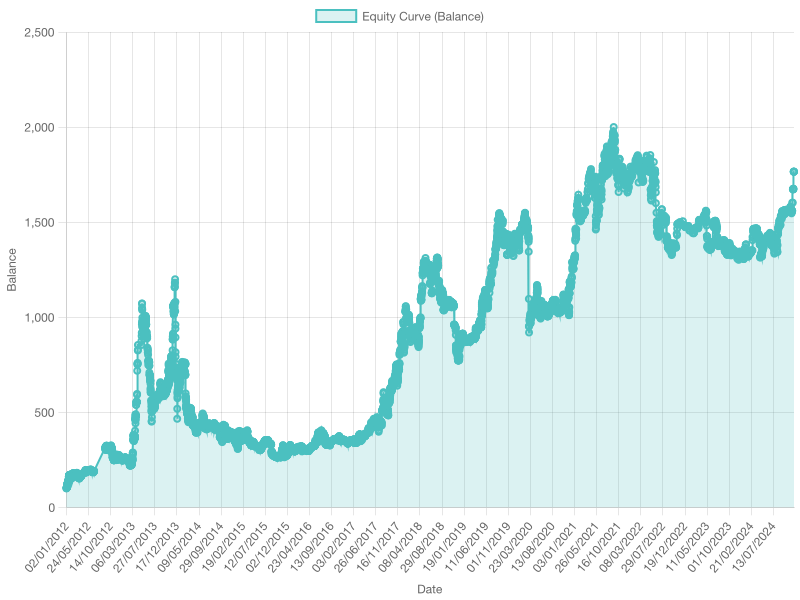

# Pépito Trader

The project simulates buying and selling BTC based on the logs of [Pepito Catto](https://x.com/PepitoTheCat).

# Pre-requisites
- [NodeJS](https://nodejs.org/en/download) (tested with v23.5.0)

# Setup
1. Clone the repository

``` 
git clone https://github.com/yachiruXBT/pepitotrader.git
```

2. Install dependencies
```
cd pepitotrader
npm i
```

3. Setup data 
```
cd data
```
Input data files:
1. [Historical BTC price](https://www.kaggle.com/datasets/mczielinski/bitcoin-historical-data) - Download & extract the file `btcusd_1-min_data.csv` rename to `btcusd.csv`
2. [Pepito Adventure log](https://github.com/Clement87/Pepito-data/blob/main/tweets.json) - See note below as this is pruned  and part of the repository already.

Output data file:
1. Pepito Trader - An intermediate file `pepito_trader.csv` is created which consists of matching in & out events with the closest BTC price. 

Your data directory should look as follows
```
btcusd.csv
tweets_latest.json
pepito_trader.csv
```
   

- Execute the script
```
node meow.mjs  --initTrading --pepitoTrade
```
- `initTrading` - Flag creates an intermediate file that matches pepitos in & outs with the closest 1-minute BTC price. 
- `pepitoTrade` - Executes the buy/sell based on the matched price. This creates an equity balance curve. 

You can use the flags independently or in combination. If you update any data files, you need to run them both.

# Results
The script analyzed 23135 logs. Due to some inconsistencies in the data set - we matched 16380 paired events (described below).
- Total Events: 23135
- Starting Balance: 9 USD
- Trades executed: 16380
- Closing balance: 158.87
- Returns: 1665.22%



# Notes
- The current data (see below); has some in-consistencies as not every out is matched to an in message.
The current calculation skips these inconsistencies and matches the first out to the first in the message.
Any repetitions on either side or between the two are skipped.

Ex :
```
[OUT] , OUT , OUT , [IN] , IN , [OUT] , [IN]
```
The above stream matches the first IN message to the first OUT message ( marked in brackets).
These together comprise a trade. I.e. buy when Pepito goes out and sell when Pepito comes in. 

- The BTC price data starts from Jan 1, 2012. However, the Pepito logs begin on Nov 13, 2011, so you need
to prune this data set.


# Future Ideas/TODO's
- Integrate with the live API of [Pepito](https://github.com/Clement87/Pepito-API) for real-time usage.
- Give a bonus to Pepito on his birthday. (Aug 4th 2007)
- Calculate Max/Min Profit/losses incurred.
- Clean up code.

# Pépito raw data
- BTC price source with 1 minute resolution :https://www.kaggle.com/datasets/mczielinski/bitcoin-historical-data
- Pepito Cat Adventure logs : https://github.com/Clement87/Pepito-data/blob/main/tweets.json

Thanks to [Clement](https://github.com/Clement87) for diligently collecting the data and making it available for use.
